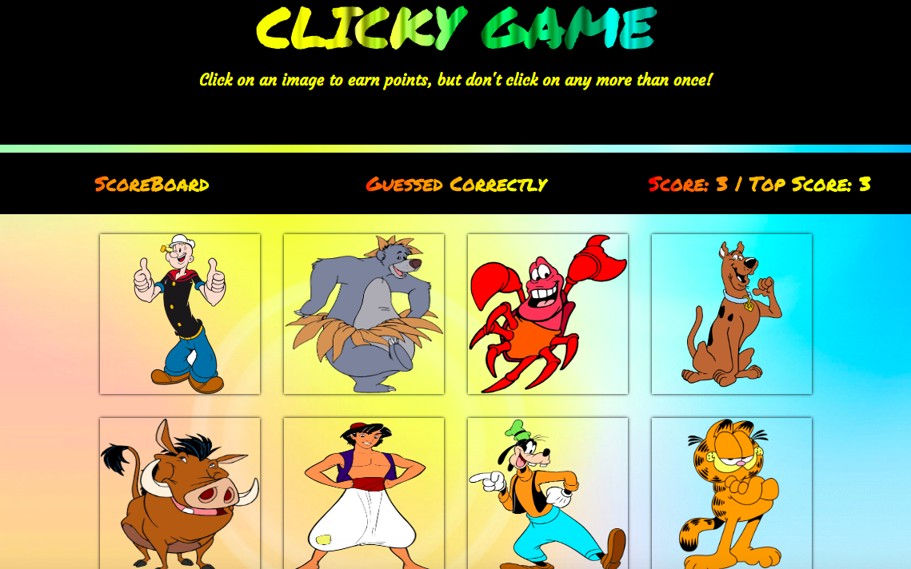

# Clicky Game React

## About
Clicky game is a react application wherein user can click on images to score points. But, user can only click on an image once. If he clicks on the same image more than once, the game ends. Game keeps track of the highest score of the current session. If user scores 16 without any repeats, he wins and the game resets. 

## Deployed Link
[Clicky-Game](https://ajitas.github.io/Clicky-Game-React/)

## Application Preview


## Technologies used
This is a client-side application that uses
1. HTML5
2. CSS 3
3. Bootstrap 4
4. Javascript
5. React.js

## Execution steps on local machine
1. Download/Clone the respository.
2. Make sure yarn is installed on your machine.
3. On terminal, go inside Clicky-Game-React folder and type yarn install. This will install all the dependencies required to run the application mentioned in package.json.
4. In the same folder on terminal, type "yarn start", this will start the application on your localhost:3000.

## Code snippets
```
state = {
        allPictures:friends,           
        pictures:friends.slice(0,8),    
        score:0,                       
        highscore:0,                
        message:"Click to Start!",     
        alreadyPicked :[]               
    }
```
These are the state attributes that we are keeping track of:
* allPictures: contains the whole array of friends
* pictures: contains only 8 pictures from friends array
* score: has the score of the current game
* highscore: has the highest score of the current session
* message: message for user
* alreadyPicked: contains ids of all images user has clicked in current game

```
 componentDidMount() {
    const newPictures = this.shuffle(this.state.allPictures);
    this.setState({pictures:newPictures});
  }
```
When component is mounted, shuffle allPictures array and set state.pictures as the result which has first 8 images from the shuffled allPictures array

```
shuffle = arr =>{
  for (let i = arr.length - 1; i > 0; i--) {
      const j = Math.floor(Math.random() * (i + 1));
      const x = arr[i];
      arr[i] = arr[j];
      arr[j] = x;
  }
```
Shuffle the 16 images in allPictures array.

```
for(let j=0;j<8;j++){
  const len = this.state.alreadyPicked.filter(id=> id===arr[j].id).length;
  if(len===0)
      return arr.slice(0,8);
  }
  return [];
```
Pick first 8 pictures from the shuffled array and check if there is any image that does not exist in alreadyPicked array yet. As soon as we found the first image among the 8 images picked, that does not exist in alreadyPicked array yet,return the first 8 images of the shuffled array of 16 images. If all first 8 images in shuffled array exist in alreadyPicked array, return empty array

```
handleClick = id => {
  const len= this.state.alreadyPicked.filter(idOfImage => idOfImage === id).length;
  const newAlreadyPicked = (len===0)?this.state.alreadyPicked.concat(id):[];
  const newScore = (len===0)?this.state.score+1:0;
  const newMessage= (len===0)?"Guessed Correctly":"Guessed Incorrectly";
  this.setState({message:newMessage, score:newScore, highscore:newHighScore});
```
On click of an image, filter alreadyPicked array to see if the clicked image's id exists in it or not. If it does not exist, clicked id will be added to alreadyPicked array, else alreadyPicked will become [].If it does not exist, score of the current game will be incremented, else it becomes 0. Set the message accordingly.

```
if(newScore<this.state.allPictures.length){
  this.setState({alreadyPicked:newAlreadyPicked},
      () => { 
          let that = this;
          (function loop(){
              let newPictures = that.shuffle(that.state.allPictures); 
              if(newPictures.length===0)
                  loop();
              else
                  that.setState({pictures:newPictures})
          }());   
      }
  );
```
If statement above checks if there are still images left that are unclicked. If there are, set alreadyPicked array to newAlreadyPicked array initialize above. Once it it set, we run a function to check if the 8 images shown on the page should have at least one unclicked image. It loops through and keeps calling shuffle method until the shuffle method returns a non-empty array of 8 images.

```
(function() {
    if(newMessage === "Guessed Incorrectly"){
        setTimeout(()=> {
            that.setState({message:"Click to start again!"});
        }, 1000);
    }
}());
```
Javascript function to show new message after 1 second if user loses.

```
else {
  const that = this;
  that.setState({message:"You won!Game resetting..",score:that.state.score+1, highscore:that.state.highscore+1 });

  (function() {
      setTimeout(()=> {
          that.setState({message:"Click to Start!",score:0,allPictures:friends,alreadyPicked :[]},
              ()=>{
                  const newPictures = that.shuffle(that.state.allPictures);
                  that.setState({pictures:newPictures});
              }
          );
      }, 2000);   
  }());
}
```
This else statement is executed when user has clicked on all 16 images once and won the game. Change the state.message to show game won message, update score and high score. Javascript function resets the game after waiting for 2 seconds by shuffling the 8 images on screen.

## Learning points
1. Creating a react application.
2. Adding react dependencies using yarn.
3. Use of JSX and react components.
3. deploying react application on github.


## Author 
* [Ajita Srivastava Github](https://github.com/ajitas)
* [Ajita Srivastava Portfolio](https://ajitas.github.io/Portfolio/)

## License
Standard MIT License